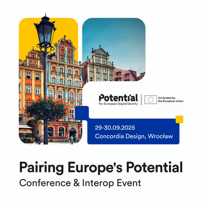

<!-- var(subject)="Invitation | Pairing Europe’s Potential – Interoperability Event - 29–30 September 2025, Wrocław [new link]" -->
<!-- var(summary)="[Potential] Interoperability Event - 29–30 September 2025, Wrocław" -->
<!-- var(role)="Coordinator" -->
Dear POTENTIAL and Aptitude partners,  

The Ministry of Digital Affairs of Poland is pleased to invite you to **Pairing Europe’s Potential**, a two-day interoperability and conference event taking place on:  

This event will bring together leading experts and stakeholders in the field of digital identity for a rich and dynamic program, including:  

- **Conference sessions** with panels and expert discussions  
- **Workshops** on key topics such as cybersecurity, onboarding to the EUDI Wallet, QES pilot, certification, and legislation  
- **Interoperability sessions** to test prototype wallets from different countries under near real-life conditions  
- **Networking opportunities**, including an evening reception to foster connections across Europe  

**Pairing Europe’s POTENTIAL** will also serve as a milestone to **summarize the results of the POTENTIAL project** and reflect on the next steps for Europe’s digital identity ecosystem.  

⚠️ **Correction**: the registration link in the previous invitation contained an error.  
👉 Please confirm your participation by registering here:  
[<!-- link-model=button --><!-- color=#313178 --> ☆ Correct Registration Link ☆ ](https://luma.com/h3nh8ayu)

Participation will also be possible **online**, with full access to the conference sessions.

For any questions regarding the event or its organization, please contact:  
- **Michał Kowalewski-Li** – michal.kowalewski-li@cyfra.gov.pl  
- **Anthony Carmoy** – anthony.carmoy@interieur.gouv.fr (for interoperability sessions)  

We apologize for the inconvenience and thank you for your understanding.  
We look forward to welcoming you in Wrocław for this important European gathering.  

Best regards,  