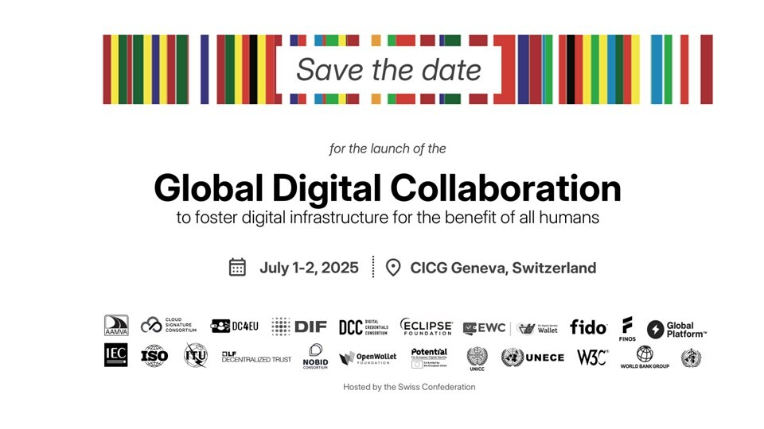

<!-- var(subject)="Participation to the Gobal Digital Collaboration Conference, July 1-2, 2025 in Geneva" -->
<!-- var(summary)="The Open Wallet Foundation invites you to the Global Digital Collaboration Conference on July 1-2, 2025, in Geneva, gathering global leaders to discuss key topics on digital identity, including eIDAS 2.0 and LSPs. Free invitations are available for LSP partners—sign up via the provided link." -->
<!-- var(role)="" -->
Dear All,
 
The Open Wallet Foundation is organizing the **Global Digital Collaboration Conference** on **July 1-2, 2025 in Geneva**, at the _Centre International de Conférences Genève (CICG)_ 📍.
 
This conference is particularly significant, coinciding with the conclusion of the first round of LSPs and the finalization of the eIDAS 2.0 implementing acts. As eIDAS continues to evolve, this gathering offers a critical platform for global collaboration. High-level representatives from the EU, China, US, Japan, India, Trinidad & Tobago, and other regions will convene to discuss essential use cases such as driver’s licenses, healthcare, payments, and travel.

We believe this event is a pivotal opportunity to foster collaboration across borders and shape the future of digital identity on a global scale. It is essential to bring together key actors at this crucial stage to enhance mutual understanding and cooperation.

The event will also feature major public and private sector stakeholders. As LSPs are vital components of the eIDAS ecosystem, we are pleased to offer **free invitations** to all partners from both the first and second-round LSPs. If you are interested in attending, **please complete this form** to request your tickets and specify the number of passes required:

[<!-- link-model=button --><!-- color=#313178 --> ☆ Secure Your Spot ☆ ](https://cloud.digital-identity-wallet.eu/apps/forms/s/7McopBnDayf5tCDWLDgsLtTQ)
 
**Additionally, we encourage you to actively contribute to the conference by proposing relevant topics for roundtables, demos, or other sessions in the "Topics" section of the form.**
 
We look forward to your participation and valuable contributions!

Best regards,