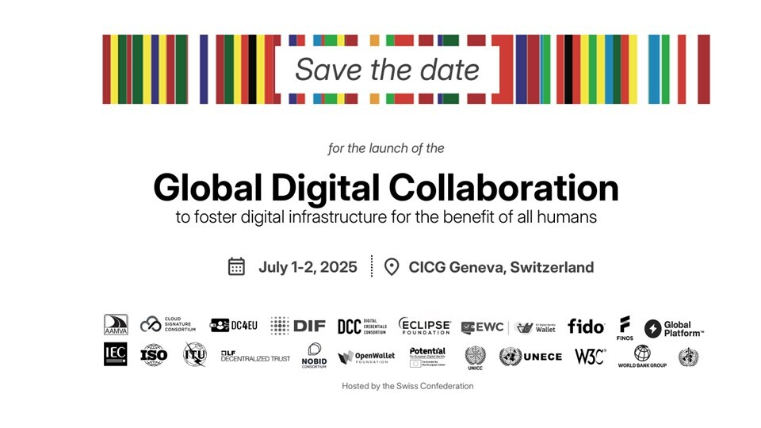

<!-- var(subject)="Participation à la conférence Gobal Digital Collaboration le 1er et 2 juillet 2025 à Genève" -->
<!-- var(summary)="L’Open Wallet Foundation vous invite à la Conférence Gobal Digital Collaboration les 1er et 2 juillet 2025 à Genève, réunissant des leaders mondiaux pour renforcer la collaboration internationale autour de l'identité numérique." -->
<!-- var(role)="" -->
Bonjour,

L’Open Wallet Foundation a le plaisir de vous inviter à la **Conférence Gobal Digital Collaboration** qui se tiendra les **1er et 2 juillet 2025**, au Centre International de Conférences de Genève (CICG) 📍.

Cette conférence revêt une importance particulière, coïncidant avec la conclusion de la première série de LSPs et la finalisation des actes d’exécution d’eIDAS 2.0. Alors que l'écosystème eIDAS continue d’évoluer, cet événement offre une plateforme pour la collaboration mondiale. Des représentants de haut niveau de l’UE, de la Chine, des États-Unis, du Japon, de l’Inde, de Trinité-et-Tobago, et d’autres régions se réuniront pour discuter des cas d’usage tels que les permis de conduire, la santé, les paiements et les voyages.

Nous pensons que cet événement constitue une occasion de **renforcer la collaboration internationale autour de l'identité numérique**. 

L'événement réunira d'importants acteurs publics et privés. Étant donné que les consortiums sont des composants essentiels de l’écosystème eIDAS, nous sommes heureux d’offrir des invitations à tous les partenaires des LSPs.

Si vous souhaitez participer, **merci de remplir ce formulaire** pour demander vos billets et préciser le nombre de places requises :

[<!-- link-model=button --><!-- color=#313178 --> ☆ Secure Your Spot ☆ ](https://cloud.digital-identity-wallet.eu/apps/forms/s/7McopBnDayf5tCDWLDgsLtTQ)

**Par ailleurs, nous vous encourageons à contribuer à la conférence en proposant des sujets d'échanges, des démonstrations ou autres dans la section "Sujets" du formulaire.**

Nous nous réjouissons de votre participation et de vos contributions précieuses !

Bien cordialement,